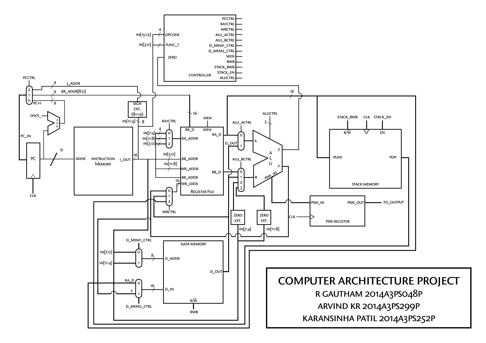

# Design os a 16-bit processor using Verilog

The behavioral HDL model for a single cycle MIPS-ISA processor that successfully executes arithmetic, logical, shift and branch instructions based on the following design diagram has been implemented on Verilog. 

